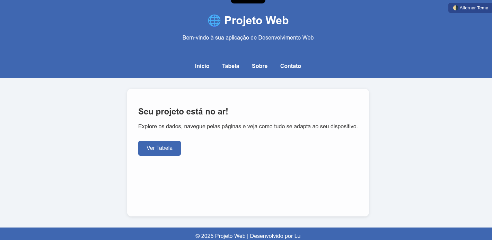
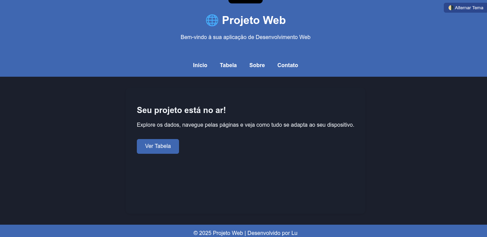
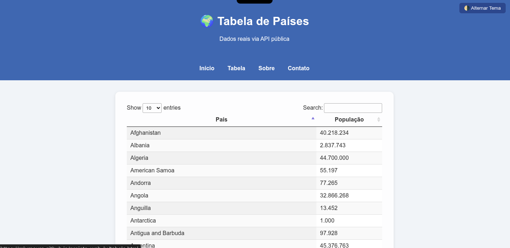
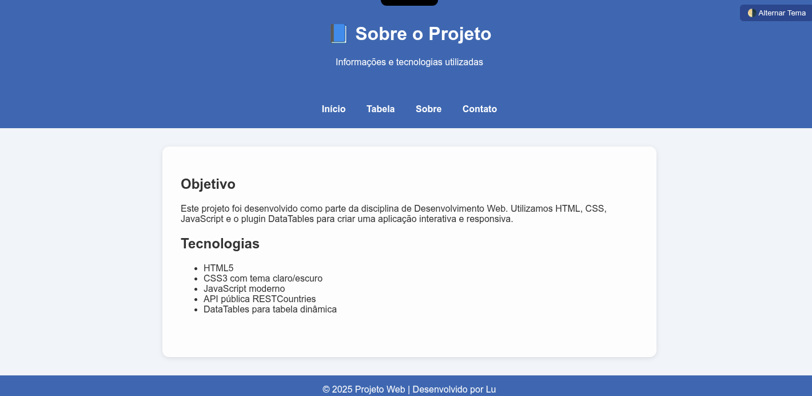
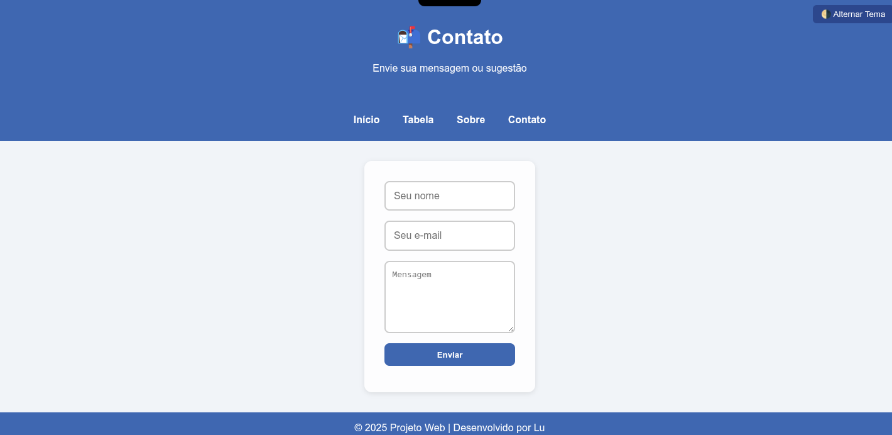

# 🌐 Projeto Web: Painel Interativo com Tema Escuro

Este é um projeto web desenvolvido como parte de um estudo prático de HTML, CSS e JavaScript. A aplicação apresenta um painel interativo com tema claro/escuro, dados dinâmicos via API, formulário funcional e layout responsivo.

## ✨ Funcionalidades

- Alternância entre tema claro e escuro 🌗  
- Tabela de países com dados reais via API 📊  
- Formulário de contato com envio real via FormSubmit 💌  
- Layout responsivo para desktop e mobile 📱  
- Animações suaves e design personalizado 🎨  

## 🧩 Tecnologias utilizadas

- HTML5  
- CSS3 (com variáveis e animações)  
- JavaScript puro  
- DataTables.js  
- FormSubmit (serviço externo para envio de formulários)  
- API pública de países/população  

## 📁 Estrutura do projeto

📦 projeto-web-lu
├── index.html
├── tabela.html
├── sobre.html
├── contato.html
├── style.css
└── /imagens

## 🚀 Como visualizar

O projeto está publicado via GitHub Pages e pode ser acessado aqui:  
👉 [https://mlumoura.github.io/projeto-web-lu/](https://mlumoura.github.io/projeto-web-lu/)

## 🖼️ Capturas de tela

### Página inicial (modo claro)

### Página inicial (modo escuro)

### Tabela de países

### Página "Sobre"

### Página de contato

## 📌 Observações

Este projeto foi desenvolvido com fins educacionais e criativos. Cada funcionalidade foi construída passo a passo, com foco em aprendizado, estética e interatividade.

## 💙 Autoria

Desenvolvido por **Lu**, com apoio do Copilot da Microsoft.  
Projeto criado com carinho, curiosidade e muita costura digital 🧶
